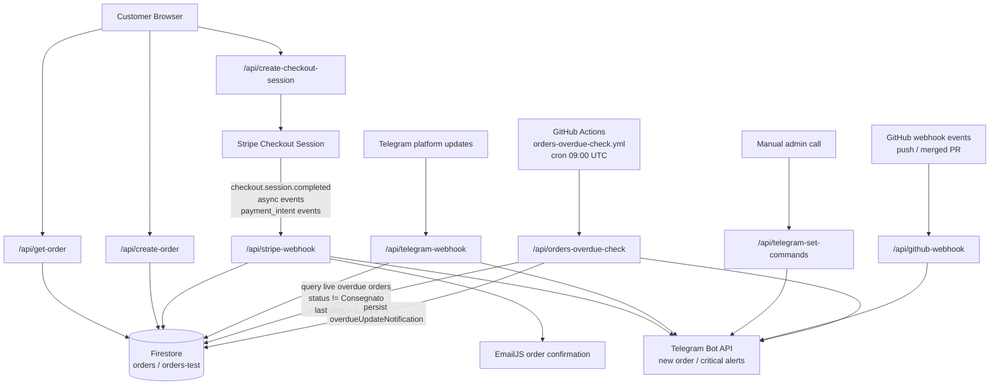

[](https://app.netlify.com/sites/uuuk/deploys)
[](https://www.gatsbyjs.com/)
[](https://www.typescriptlang.org/)
[](https://reactjs.org/)
[](https://nodejs.org/)
[](https://www.npmjs.com/)
[](https://opensource.org/licenses/MIT)

<p align="center">
  <a href="https://www.gatsbyjs.com/?utm_source=starter&utm_medium=readme&utm_campaign=minimal-starter-ts">
    
  </a>
</p>
<h1 align="center">
  Gatsby Minimal TypeScript Starter
</h1>

## 🚀 Quick start

1.  **Create a Gatsby site.**

    Use the Gatsby CLI to create a new site, specifying the minimal TypeScript starter.

    ```shell
    # create a new Gatsby site using the minimal TypeScript starter
    npm init gatsby -- -ts
    ```

2.  **Start developing.**

    Navigate into your new site’s directory and start it up.

    ```shell
    cd my-gatsby-site/
    npm run develop
    ```

3.  **Open the code and start customizing!**

    Your site is now running at http://localhost:8000!

    Edit `src/pages/index.tsx` to see your site update in real-time!

4.  **Learn more**
    - [Documentation](https://www.gatsbyjs.com/docs/?utm_source=starter&utm_medium=readme&utm_campaign=minimal-starter-ts)
    - [Tutorials](https://www.gatsbyjs.com/docs/tutorial/?utm_source=starter&utm_medium=readme&utm_campaign=minimal-starter-ts)
    - [Guides](https://www.gatsbyjs.com/docs/how-to/?utm_source=starter&utm_medium=readme&utm_campaign=minimal-starter-ts)
    - [API Reference](https://www.gatsbyjs.com/docs/api-reference/?utm_source=starter&utm_medium=readme&utm_campaign=minimal-starter-ts)
    - [Plugin Library](https://www.gatsbyjs.com/plugins?utm_source=starter&utm_medium=readme&utm_campaign=minimal-starter-ts)
    - [Cheat Sheet](https://www.gatsbyjs.com/docs/cheat-sheet/?utm_source=starter&utm_medium=readme&utm_campaign=minimal-starter-ts)

## 🚀 Quick start (Netlify)

Deploy this starter with one click on [Netlify](https://app.netlify.com/signup):

[](https://app.netlify.com/start/deploy?repository=https://github.com/gatsbyjs/gatsby-starter-minimal-ts)

## Environment variables

For checkout, webhook processing, and transactional emails, configure these variables in your local and deploy environments:

- STRIPE_API_KEY
- STRIPE_WEBHOOK_SECRET
- FIREBASE_SERVICE_ACCOUNT
- EMAILJS_SERVICE_ID
- EMAILJS_TEMPLATE_ID
- EMAILJS_PUBLIC_KEY
- EMAILJS_PRIVATE_KEY
- TELEGRAM_BOT_TOKEN
- TELEGRAM_CHAT_ID (admin chat allowed to run /orders)
- TELEGRAM_WEBHOOK_SECRET (optional but recommended)
- TELEGRAM_SETUP_SECRET (optional, protects /api/telegram-set-commands)
- GITHUB_WEBHOOK_SECRET
- GITHUB_WEBHOOK_BRANCHES (optional, comma-separated, defaults to main,master)
- ORDERS_OVERDUE_CRON_SECRET (optional but recommended; protects /api/orders-overdue-check)

The webhook at src/api/stripe-webhook.ts sends a confirmation email after checkout.session.completed with order line items and invoice/receipt links (when available).
The webhook at src/api/github-webhook.ts accepts GitHub push and pull_request events, then sends a Telegram message to topic 41 for pushes and merged PRs on tracked branches (defaults to main,master).
The webhook at src/api/telegram-webhook.ts handles Telegram bot commands:
The endpoint at src/api/orders-overdue-check.ts checks live orders for stale updates (older than 3 days) and sends Telegram alerts only when:

- the order status is not Consegnato
- the order is not a test order
- the last overdue Telegram alert was sent more than 3 days ago (tracked in order.overdueUpdateNotification)

It sends alerts to the order Telegram chat/topic (with env fallback TELEGRAM_CHAT_ID + TELEGRAM_TOPIC_ID, default topic 9).

- /start or /help: greeting + command reference
- /orders [n]: compact list of recent orders (only in TELEGRAM_CHAT_ID)
- /order <id>: compact status for a specific order ID/session ID/document ID
- /order <id> <chatId>: forwards an order update to another chat (admin chat only)
- /status and /ping: health checks

To enable Telegram webhook delivery, point your bot webhook to:

- https://<your-domain>/api/telegram-webhook

Example webhook registration command:

```bash
curl -X POST "https://api.telegram.org/bot<TELEGRAM_BOT_TOKEN>/setWebhook" \
  -H "Content-Type: application/json" \
  -d '{"url":"https://<your-domain>/api/telegram-webhook","secret_token":"<TELEGRAM_WEBHOOK_SECRET>"}'
```

To register the bot command menu from your own backend, call:

```bash
curl -X POST "https://<your-domain>/api/telegram-set-commands" \
  -H "x-telegram-setup-secret: <TELEGRAM_SETUP_SECRET>"
```

Endpoint behavior:

- Sets default commands for all chats: /start, /help, /order, /status, /ping
- Sets admin chat scoped commands (TELEGRAM_CHAT_ID): adds /orders and /recent

## GitHub cron for overdue orders

Workflow file: .github/workflows/orders-overdue-check.yml

- Runs daily at 09:00 UTC (plus manual trigger via workflow_dispatch)
- Sends POST request to ORDERS_OVERDUE_CHECK_URL
- Authenticates with header x-orders-overdue-cron-secret using ORDERS_OVERDUE_CRON_SECRET

Required GitHub Actions secrets:

- ORDERS_OVERDUE_CHECK_URL (example: https://<your-domain>/api/orders-overdue-check)
- ORDERS_OVERDUE_CRON_SECRET (must match deploy env ORDERS_OVERDUE_CRON_SECRET)

## Workflow diagram


